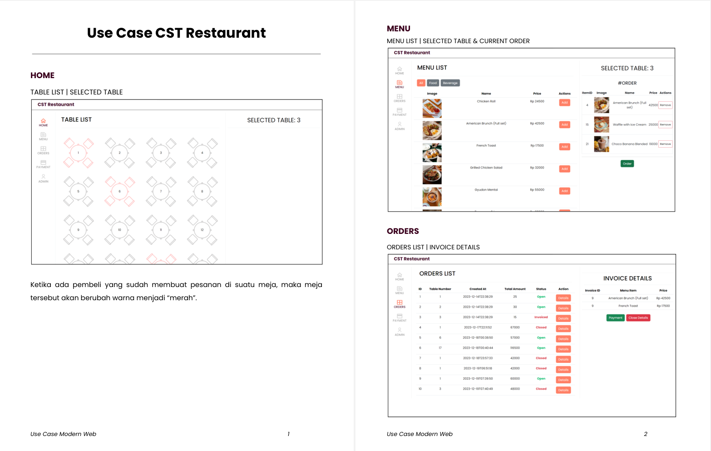
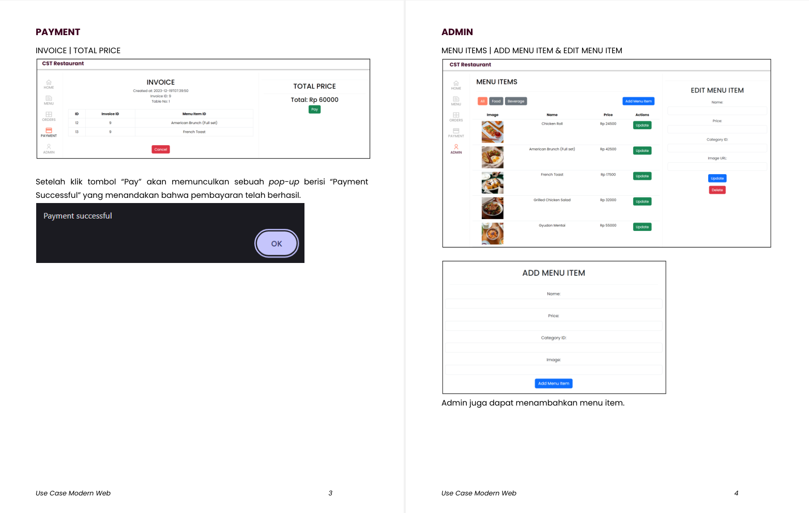

# CST-Restaurant
Simple Restaurant Web Project

## How to run the web application

You need to have docker, then run this for the first time.
`docker compose up --build`

Next time, just run
`docker compose up`

To stop this app, just run
`docker compose down`

## If you want to run this without docker, then

Three components must be running:
1. MySQL
2. Flask server
3. Node.js runtime

(mysql)
start any mySQL server at localhost:8080

(backend)
Install all requirements, then
flask run

(frontend)
do npm install to run the project
then npm run serve

MySQLAlchemy will automatically create a database based on the models on mysql://root:@127.0.0.1/cstresto